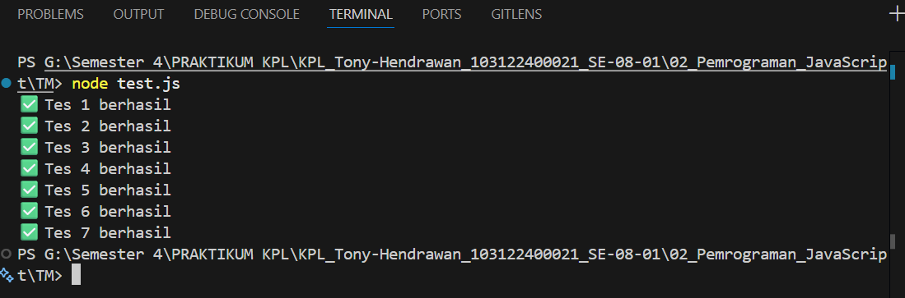

# Tugas Pendahuluan 02: Pemrograman JavaScript
**Soal**

Buatlah sebuah fungsi bernama fizzBuzz yang menerima input larik (array) dan mengembalikan deretan bilangan dan "Fizz" untuk kelipatan 2, "Buzz" untuk kelipatan 7, dan "FizzBuzz" untuk kelipatan 14. Beri nama berkas program sebagai tm.js dan taruh di direktori TM.

**Kode sumber**

Tersedia di [tm.js](./tm.js)
Tersedia di [test.js](./test.js)

**Output**

**Deskripsi Program**

Pada tm.js fungsi fizzBuzz menerima sebuah array angka sebagai input. Program akan memeriksa setiap elemen dalam array dan mengganti angka tertentu berdasarkan aturan: jika kelipatan 14 maka menjadi "FizzBuzz", jika kelipatan 2 menjadi "Fizz", dan jika kelipatan 7 menjadi "Buzz". Jika tidak memenuhi kondisi tersebut, angka tetap ditampilkan. 

Hasilnya kemudian digabung menjadi string yang dipisahkan spasi dan dikembalikan sebagai output. Jika input bukan array, fungsi akan mengembalikan pesan "Input tidak valid". Fungsi ini kemudian diekspor menggunakan module.exports agar dapat digunakan di file test.js. Dimana test.js sudah diubah sedikit, yaitu penghapusan "," pada pada string perbandingan agar test bisa berjalan dengan baik.