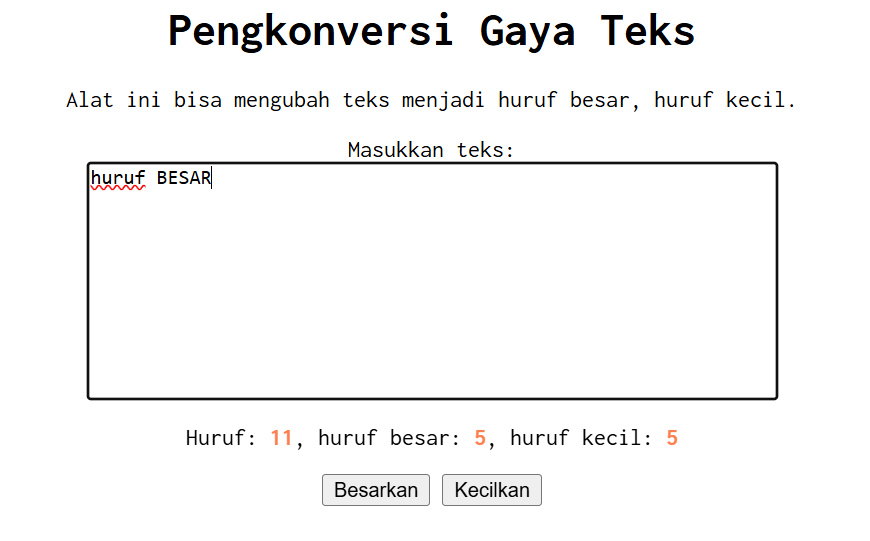

# Tugas Pendahuluan 02: GUI dengan HTML dan CSS

**Nama:** Tony Hendrawan  
**NIM:** 103122400021  
**Kelas:** SE-08-01

## Tugas

Terapkanlah fungsi untuk (1) menghitung huruf kecil yang disediakan di #hk, (2) mengubah huruf kecil ke huruf besar ketika pengguna menekan tombol #huruf-besar, dan (3) mengubah huruf besar ke huruf kecil ketika pengguna menekan tombol #huruf-kecil. Kemudian, hapuslah fitur "Paragrafkan" dari alat.

## Program/Kode

Tersedia di [index.html](./index.html), [index.css](./index.css), [index.js](./index.js)

## Output

## Deskripsi

Program menggunakan HTML, CSS, dan JS untuk menyediakan area input teks. JavaScript memanggil elemen dengan document.getElementById(), lalu memasang event input agar setiap perubahan teks langsung memperbarui jumlah karakter, jumlah huruf besar, dan jumlah huruf kecil. Selain itu, tombol dipakai untuk mengubah seluruh teks menjadi huruf kapital atau huruf kecil. CSS dipakai untuk menata tampilan agar tetap rapi, terpusat, dan nyaman dibaca.

