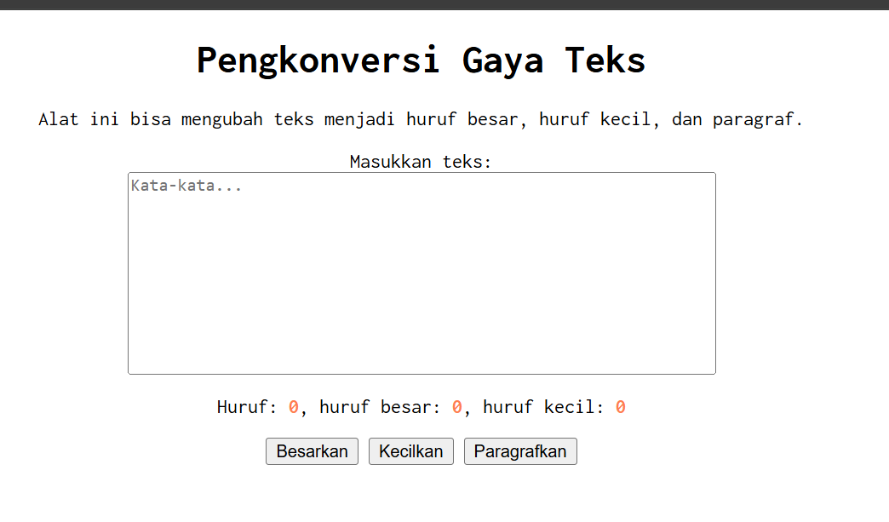

# Tugas Pendahuluan 02: Pemrograman JavaScript
**Soal**

Kamu sudah menulis fungsi mulOfArray. Ujilah dengan input [2, 0, 26, 28, -2], dengan output yang seharusnya adalah 1456. Jika kamu menemukan bahwa hasilnya berbeda, bisakah kamu memperbaikinya? Jika kamu menemukan bahwa hasilnya sama, bisakah kamu menjelaskan mengapa demikian?

**Kode sumber**

Tersedia di [index.html](./index.html)
Tersedia di [index.css](./index.css)
Tersedia di [index.js](./index.js)

**Output**

**Deskripsi Program**

Penerapan HTML, CSS, dan JavaScript, di mana pengguna dapat memasukkan teks ke dalam textarea. JavaScript digunakan untuk menghitung jumlah karakter secara langsung saat pengguna mengetik, sementara CSS mengatur tampilan antarmuka agar rapi dan tepat di tengah (dengan text-align: center, dan membuat margin kotak jadi auto) kemudian dengan font monospace Inconsolata.