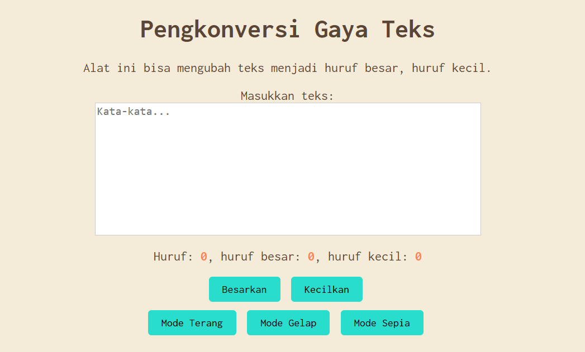

# Tugas Mandiri 04: Automata dan Table-Driven Construction

**Nama:** Tony Hendrawan  
**NIM:** 103122400021  
**Kelas:** SE-08-01

## Tugas

Tambahkan mode sepia.

## Program/Kode

Tersedia di [index.html](./index.html), [index.css](./index.css), [index.js](./index.js)

## Output

## Deskripsi

Menerapkan mode sepia dengan latar `#F4ECD8` dan teks `#5B4636`. Menambahkan tombol sepia di `mode-div` dengan `value="sepia"`, menambahkan kondisi `if` untuk toggle class `mode-sepia` saat state berubah ke atau dari `"sepia"` dan menambahkan transition agar smooth.
