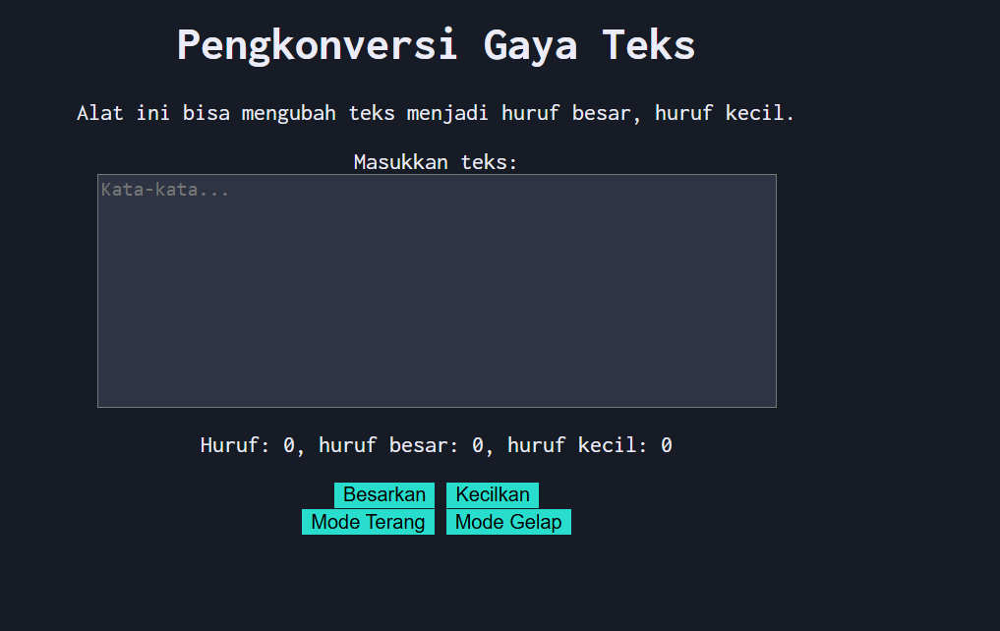

# Tugas Pendahuluan 04: Automata dan Table Driven Construction

**Nama:** Tony Hendrawan  
**NIM:** 103122400021  
**Kelas:** SE-08-01

## Tugas

Tambahkan mode gelap sekaligus untuk editor-kecil dan tombol-tombolnya. Ketentuan warna untuk latar belakang editor-kecil adalah #2e3443, sementara untuk tombol adalah #29ddcc. Teks untuk tombol tetap mengikuti warna teks sebelumnya.

## Program/Kode

Tersedia di [index.html](./index.html), [index.css](./index.css), [index.js](./index.js)

## Output

## Deskripsi

Program menggunakan HTML, CSS, dan JS untuk menyediakan area input teks. pada fokus ini adalah membuat 2 button baru pada html, kemudian menggunakan warna #29ddcc sebagai background. Kemudian mengubah warna background menjadi #171b25 pada halaman, mengubah kotak input, dan menambahkan fungsi untuk add dan remove mode-gelap.