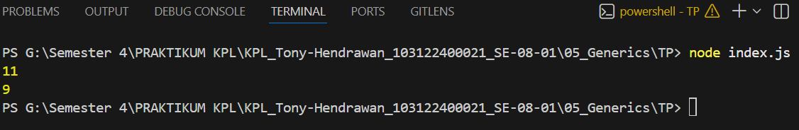

# Tugas Pendahuluan 05: Generics

**Nama:** Tony Hendrawan  
**NIM:** 103122400021  
**Kelas:** SE-08-01

## Tugas

Bagaimana caramu hanya dengan satu fungsi generik bisa mengurus kode jumlah karakter dan huruf?

## Program/Kode

Tersedia di [index.js](./index.js)

## Output

## Deskripsi

Membuat fungsi `hitung`yang memiliki dua parameter untuk teks yang dihitung dan tipenya. Kemudian, melakukan perulangan untuk mengambil per karakter pada string, cek untuk tipenya itu === "huruf", maka spasi tidak dihitung. Hasil akan disimpan di variabel jumlah dan direturn. Lalu ditampilkan menggunakan `console.log` dengan mengisi parameter tipenya. 
