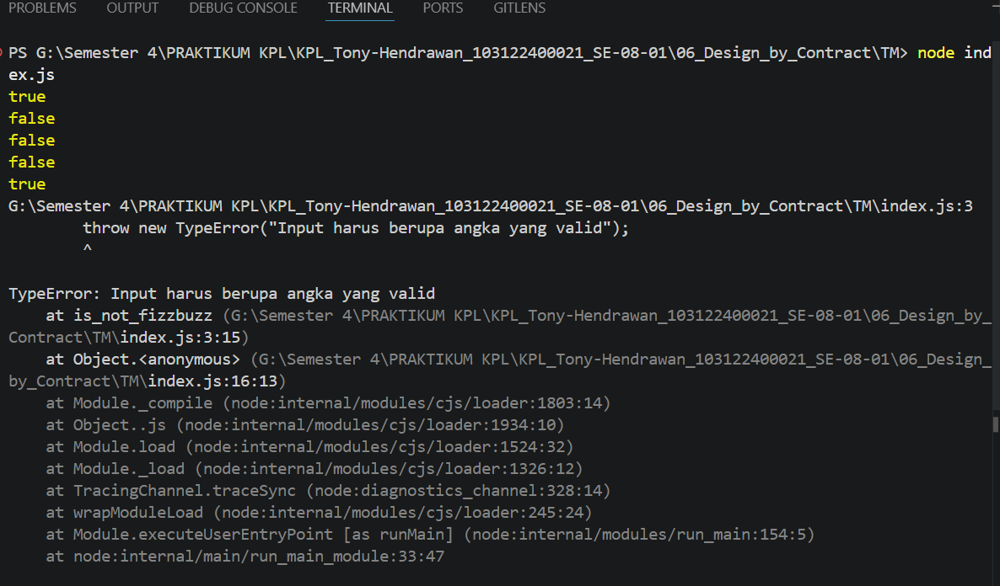

# Tugas Mandiri 06: Design by Contract dan Defensive Programming

**Nama:** Tony Hendrawan  
**NIM:** 103122400021  
**Kelas:** SE-08-01

## Tugas

Tugasmu adalah membuat fungsi yang menolak bilangan-bilangan kelipatan 3, 5, atau 15, menerima bilangan-bilangan bukan "fizz buzz", dan melempar yang bukan bilangan bulat.

```javascript
function is_not_fizzbuzz(number) {
  // TODO
}

console.log(is_not_fizzbuzz(1)) // true
console.log(is_not_fizzbuzz(3)) // false
console.log(is_not_fizzbuzz(5)) // false
console.log(is_not_fizzbuzz(30)) // false
console.log(is_not_fizzbuzz(7)) // true
console.log(is_not_fizzbuzz(null)) // Lempar TypeError
console.log(is_not_fizzbuzz(NaN)) // Lempar TypeError
console.log(is_not_fizzbuzz(Infinity)) // Lempar TypeError
```

## Program/Kode

Tersedia di [index.js](./index.js)

## Output



## Deskripsi

membuat dua percabangan if di dalam is_not_fizzbuzz dengan kondisi jika input bukan berupa number, lalu NaN, dan tak terhingga akan melempar typeError. Kemudian, jika input adalah number yg dimodulo 3 atau 5 = 0, maka akan return false.