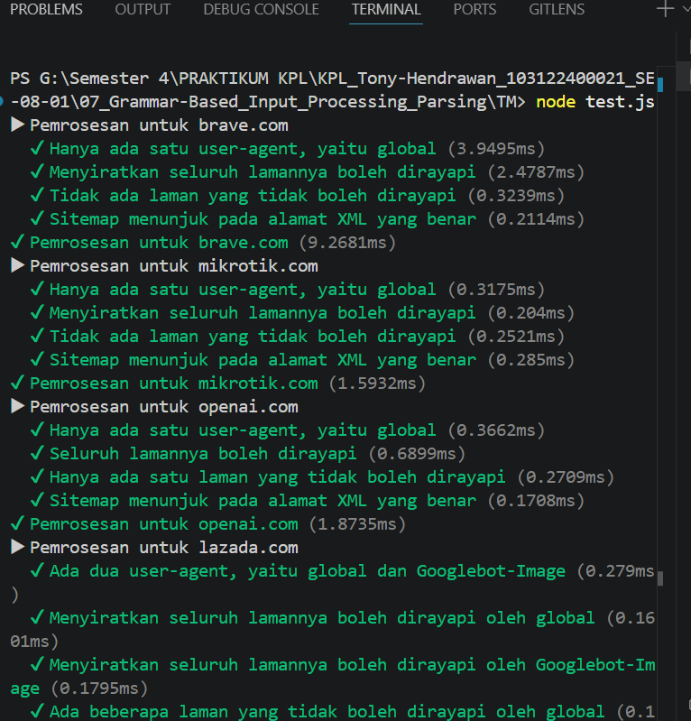
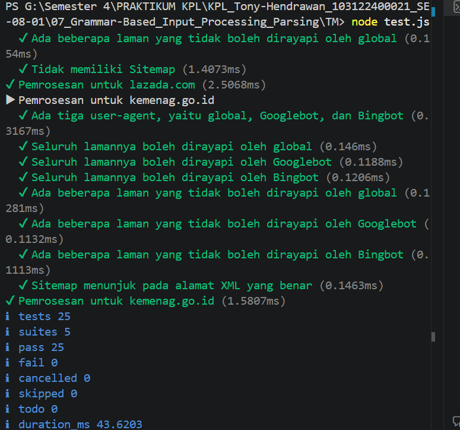

# Tugas Mandiri 07: Grammar-Based Input Processing Parsing

**Nama:** Tony Hendrawan  
**NIM:** 103122400021  
**Kelas:** SE-08-01

## Tugas

Membuat fungsi yang menguraikan isi robots.txt menjadi POJO (plain old JavaScript object)

## Program/Kode

Tersedia di [index.js](./index.js), [test.js](./test.js), dan [structure.d.ts](./structure.d.ts).
Data robots.txt: [daftar](./daftar).

## Output

## Deskripsi

Index.js membaca isi robots.txt dan memprosesnya per baris. Setelah itu, program menentukan jenis barisnya, apakah user agent, allow, disallow, sitemap, ataupun host, lalu menyimpan nilainya ke tempat yang sesuai di objek hasil. Saat user agent baru ditemukan, fokus penyimpanan berpindah ke agent tersebut agar aturan allow dan disallow masuk ke kelompok yang benar. Hasil parser dicek di test.js menggunakan beberapa contoh robots.txt.