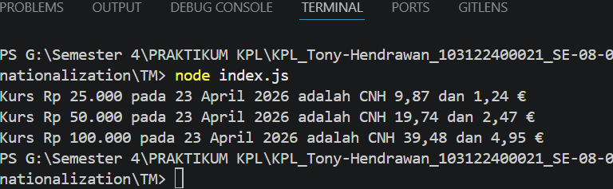

# Tugas Mandiri 08: Runtime Configuration dan Internationalization

**Nama:** Tony Hendrawan  
**NIM:** 103122400021  
**Kelas:** SE-08-01

## Tugas

Pada tugas ini kamu akan membuat program yang menampilkan kurs rupiah (IDR) terhadap renminbi luar Tiongkok (CNH) dan euro (EUR).

## Program/Kode

Tersedia di [index.js](./index.js) dan file konfigurasi [.env](./.env).

## Output

## Deskripsi

Membuat konfigurasi dari file .env untuk mengambil data dari API. Data yang didapat diformat menggunakan Intl supaya hasilnya sesuai dengan locale Indonesia, kemudian menampilkan kurs antara idr dengan CHN dan Euro.
