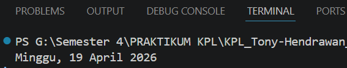

# Tugas Pendahuluan 08: Runtime_Configuration_dan_Internationalization

**Nama:** Tony Hendrawan  
**NIM:** 103122400021  
**Kelas:** SE-08-01

## Tugas

Tampilkan tanggal sekarang dengan format seperti ini: Sabtu, 18 April 2026

## Program/Kode

Tersedia di [index.js](./index.js)

## Output

## Deskripsi

Membuat tanggal saat ini dalam format bahasa indonesia menggunakan Intl.DateTimeFormat dengan locale id-ID. Format yang digunakan dengan hari, tanggal, bulan, dan tahun.
