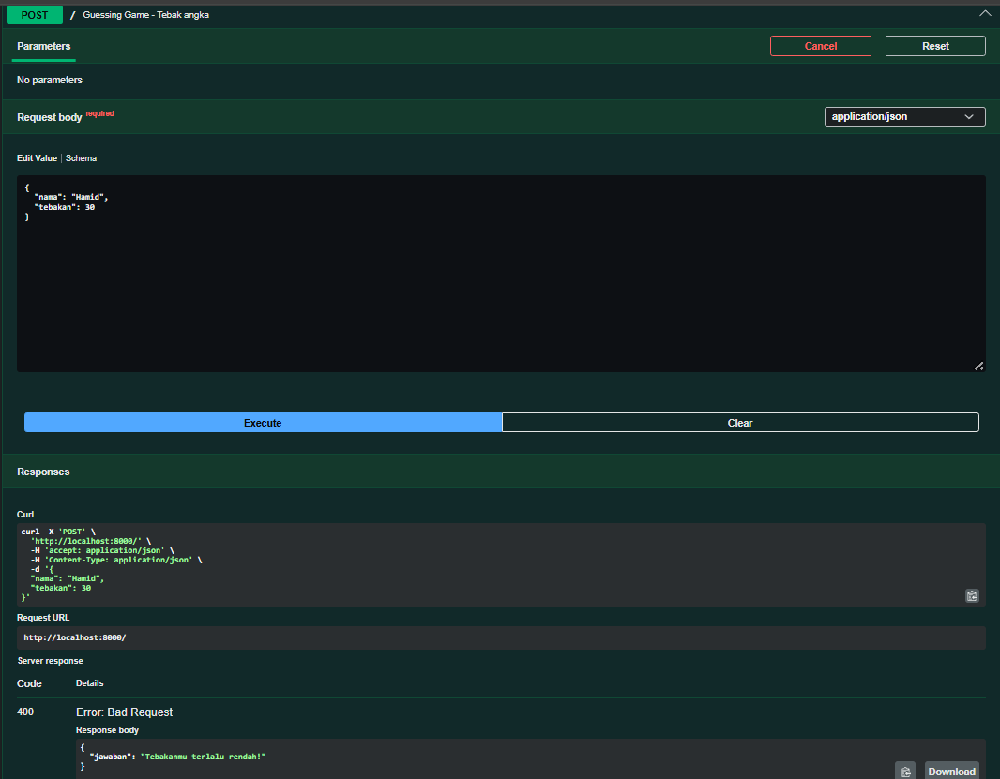
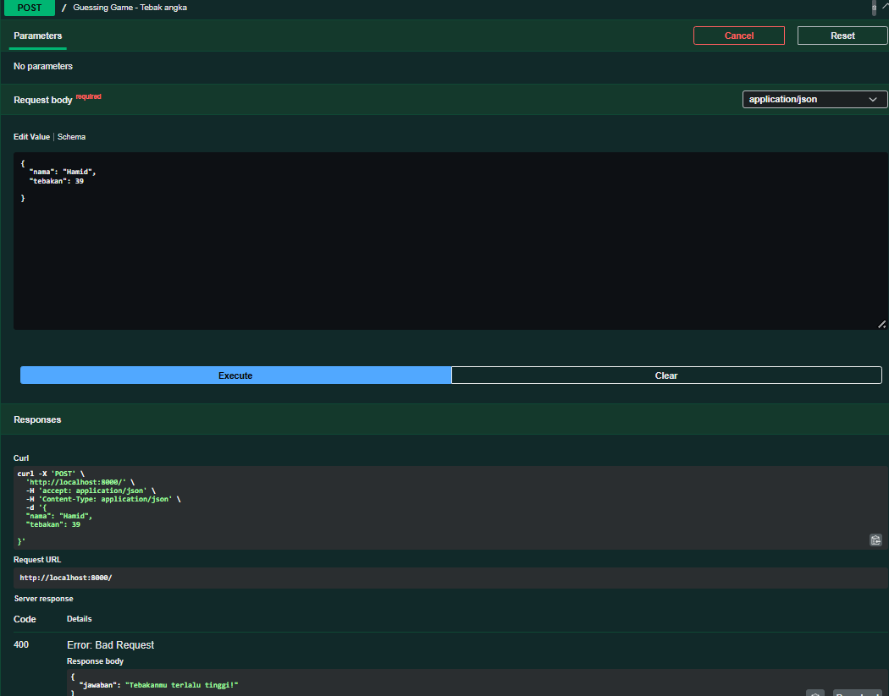

# Tugas Pendahuluan 09: API_Design_dan_Construction_Using_Swagger

**Nama:** Tony Hendrawan  
**NIM:** 103122400021  
**Kelas:** SE-08-01

## Tugas

membuat API yang terdiri dari satu endpoint saja, yaitu POST /. Ketika kita melakkukan POST.

## Program/Kode

Tersedia di [app.js](./app.js) dan [swagger.js](./swagger.js)

## Output

Hasil POST berhasil: , Terlalu rendah: , Terlalu tinggi: 

## Deskripsi

Menggunakan endpoint POST yang menerima nama dan tebakan angka (JSON). Fungsi generateAngkaRahasia(nama) menghasilkan dan menyimpan secret number unik per pemain dalam object angkaRahasia. Handler POST menerima nama dan tebakan dari request body JSON, membandingkan dengan secret number, mengembalikan response 200 (benar) atau 400 (hint terlalu tinggi/rendah).
