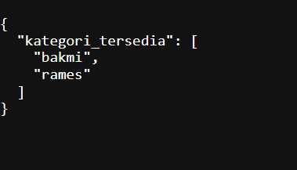
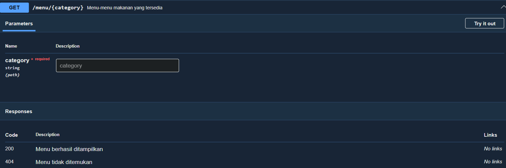

# Tugas Pendahuluan 09: API_Design_dan_Construction_Using_Swagger

**Nama:** Tony Hendrawan  
**NIM:** 103122400021  
**Kelas:** SE-08-01

## Tugas

Buatlah satu endpoint lagi beserta dokumentasi OpenAPI-nya, yaitu GET /menu yang menampilkan daftar semua nama kategori menu yang ada.

## Program/Kode

Tersedia di [index.js](./index.js)

## Output

Hasil Get: , Dokumentasi: 

## Deskripsi

Endpoint GET /menu membaca data dari objek menuData, lalu membentuk array kategori yang dikirim sebagai JSON. Dokumentasi OpenAPI dihasilkan dari komentar JSDoc oleh swagger-jsdoc.
