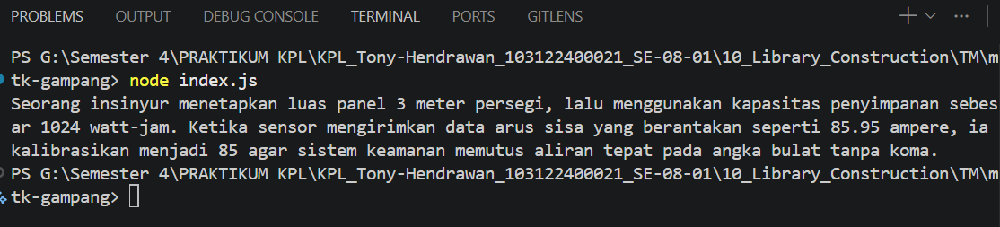

# Tugas Mandiri 10: Library Construction

**Nama:** Tony Hendrawan  
**NIM:** 103122400021  
**Kelas:** SE-08-01

## Tugas

Pada tugas ini buatlah sebuah proyek baru bernama mtk-gampang

## Program/Kode

Tersedia di [mtk-gampang/index.js](./mtk-gampang/index.js) dengan modul library di folder [lib/](./mtk-gampang/lib/):
- [lib/index.js](./mtk-gampang/lib/index.js)
- [lib/bulat.js](./mtk-gampang/lib/bulat.js)
- [lib/kuadrat.js](./mtk-gampang/lib/kuadrat.js)
- [lib/pangkat.js](./mtk-gampang/lib/pangkat.js)

## Output

## Deskripsi

Library mtk-gampang menyediakan tiga fungsi matematika utama yang diimpor dari modul lokal:

1. bulat: Mengubah bilangan desimal menjadi bulat menggunakan Math.trunc()
2. kuadrat: Menghitung akar kuadrat dari x menggunakan Math.sqrt()
3. pangkat: Menghitung x pangkat y menggunakan operator **

Kemudian install library dan diimport pada Pada entry point index.js.
