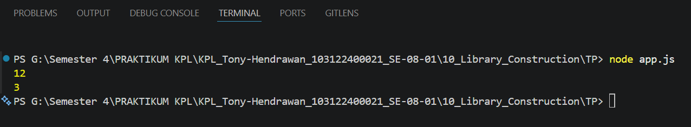

# Tugas Pendahuluan 10: Library_Construction

**Nama:** Tony Hendrawan  
**NIM:** 103122400021  
**Kelas:** SE-08-01

## Tugas

Buatlah pustaka JavaScript yang menyediakan utilitas berupa dua fungsi yang menghitung jumlah huruf dan jumlah kata.

## Program/Kode

Pustaka Javascript: [index.js](./index.js), Pemanggilan pustaka: [app.js](./app.js)

## Output

## Deskripsi

Membuat dua fungsi bernama hitungHuruf dan hitungKata yang diexport pada pustaka. Pada kedua fungsi tersebut melakukan pengecekan untuk memastikan parameter str yang diinput nanti tidak kosong, kemudian menangkap setiap huruf a-z/A-Z untuk fungsi hitungHuruf, dan menangkan kata a-z/A-Z untuk fungsi hitungKata, kemudian direturn. Kemudian pada file app.js kedua fungsi tersebut diimport dengan ESM dan mengisi parameter pada kedua fungsi sebelum ditampilkann. 
