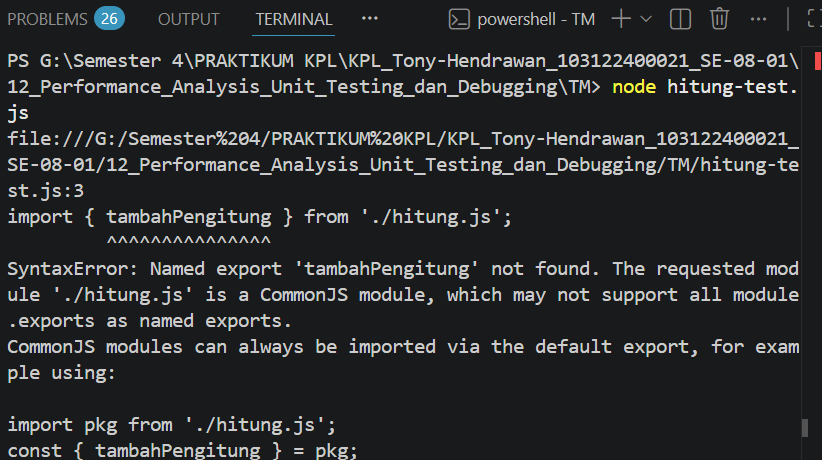
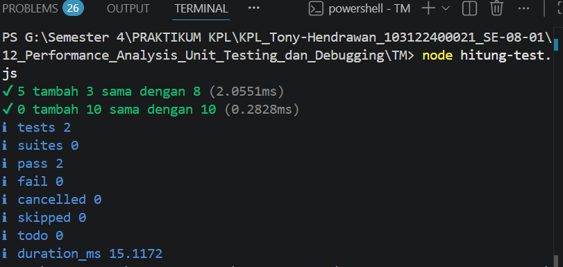

# Tugas Mandiri 12: Performance_Analysis_Unit Testing_ dan_Debugging

**Nama:** Tony Hendrawan  
**NIM:** 103122400021  
**Kelas:** SE-08-01

## Tugas

Bisakah kamu tunjukkan apakah kode sudah benar atau bagian mana yang perlu diperbaiki beserta alasannya?

## Program/Kode

File test: [hitung.js](./hitung.js), [hitung-test.js](./hitung-test.js)

## Output

Deteksi kesalahan kode:

Setelah diperbaiki:

## Deskripsi

Kode yang diberikan masih salah, perbaikan yang dilakukan adalah menambahkan export pada fungsi di hitung.js agar dapat dipakai oleh file test. Jadi, test dapat membaca bahwa fungsi penjumlahan bekerja dengan benar.
