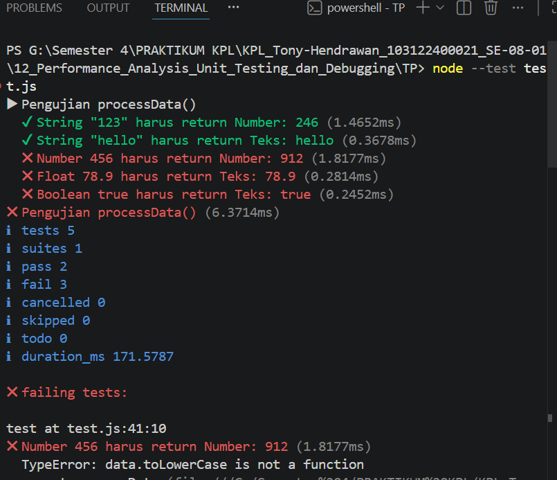

# Tugas Pendahuluan 12: Performance_Analysis_Unit Testing_ dan_Debugging

**Nama:** Tony Hendrawan  
**NIM:** 103122400021  
**Kelas:** SE-08-01

## Tugas

Cobalah untuk menangkap kecacatan dalam kode ini.

## Program/Kode

File test: [test.js](./test.js)

## Output

## Deskripsi

Melakukan deteksi bug dalam fungsi processData() menggunakan Unit Test. Bug terdeteksi, dimana fungsi mengasumsikan semua input adalah string, tetapi menerima tipe data berbeda (number, float, boolean). Ketika .toLowerCase() dipanggil pada tipe bukan string, terjadi error toLowerCase is not a function. Penyebabnya adalah kode melakukan .toLowerCase() langsung tanpa konversi tipe. 
Ini bisa diperbaiki dengan menambahkan String(data) sebelum .toLowerCase() untuk konversi semua input ke string. 
